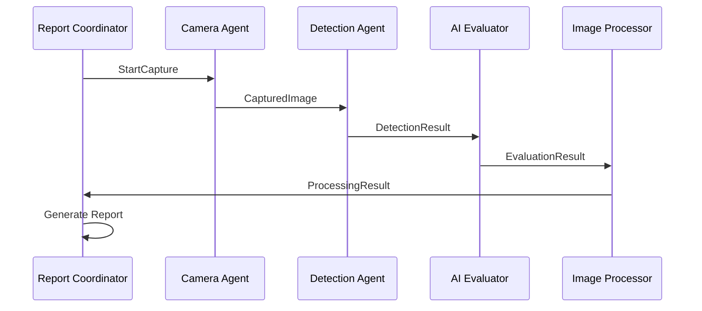

# System Architecture

## Overview
Decluttered.ai uses a modular multi-agent architecture built on Fetch.ai's uAgents framework, transforming the original monolithic Python script into five specialized, autonomous agents.

## Agent Network Topology

```
┌─────────────────┐    ┌─────────────────┐    ┌─────────────────┐
│   Camera Agent  │───▶│ Detection Agent │───▶│ AI Evaluator    │
│   Port: 8001    │    │   Port: 8002    │    │   Port: 8003    │
└─────────────────┘    └─────────────────┘    └─────────────────┘
         │                                              │
         ▼                                              ▼
┌─────────────────┐    ┌─────────────────┐    ┌─────────────────┐
│Report Coordinator│◀───┤Image Processor  │◀───┤                 │
│   Port: 8005    │    │   Port: 8004    │    │                 │
└─────────────────┘    └─────────────────┘    └─────────────────┘
```

## Message Flow Diagram

### Complete Processing Pipeline

```
1. StartSystem Message
   ↓
2. Camera Agent ──CapturedImage──▶ Detection Agent
   ↓                                ↓
3. DetectionResult ──────────────▶ AI Evaluator Agent
   ↓                                ↓
4. EvaluationResult ─────────────▶ Image Processor Agent
   ↓                                ↓
5. ProcessingResult ─────────────▶ Report Coordinator Agent
   ↓
6. Final Report Generation
```

### Detailed Message Sequence



## Agent Responsibilities

### Camera Agent (Port 8001)
- **Primary Function**: Image capture and camera management
- **Input**: StartCapture commands, user input
- **Output**: CapturedImage messages, camera status
- **State**: Camera connection, capture counters, session tracking

### Detection Agent (Port 8002)
- **Primary Function**: YOLO-based object detection
- **Input**: CapturedImage messages
- **Output**: DetectionResult messages with bounding boxes
- **State**: YOLO model, detection statistics, session objects

### AI Evaluator Agent (Port 8003)
- **Primary Function**: Gemini AI resale assessment
- **Input**: DetectionResult messages
- **Output**: EvaluationResult messages with filtered objects
- **State**: Gemini API client, evaluation history, API call tracking

### Image Processor Agent (Port 8004)
- **Primary Function**: Image cropping and file management
- **Input**: EvaluationResult messages
- **Output**: ProcessingResult messages, cropped images
- **State**: Processing statistics, file management, session tracking

### Report Coordinator Agent (Port 8005)
- **Primary Function**: System coordination and reporting
- **Input**: ProcessingResult messages, system commands
- **Output**: System status, final reports
- **State**: Global session management, system health, report generation

## Communication Protocols

### Message Types and Structure

#### 1. CapturedImage
```python
{
    "filename": "frame_1640995200.jpg",
    "timestamp": 1640995200,
    "file_path": "/path/to/captures/frame_1640995200.jpg",
    "capture_index": 1,
    "session_id": "session_1640995200"
}
```

#### 2. DetectionResult
```python
{
    "image_path": "/path/to/image.jpg",
    "timestamp": 1640995200,
    "session_id": "session_1640995200",
    "detected_objects": {"(100,150,300,400)": "laptop"},
    "unique_classes": ["laptop", "book"],
    "detection_count": 2,
    "largest_instances": {"(100,150,300,400)": "laptop"}
}
```

#### 3. EvaluationResult
```python
{
    "image_path": "/path/to/image.jpg",
    "timestamp": 1640995200,
    "session_id": "session_1640995200",
    "original_objects": ["laptop", "book", "cup"],
    "resellable_items": ["laptop", "book"],
    "evaluation_confidence": "high",
    "gemini_raw_response": "['laptop', 'book']",
    "filtered_detections": {"(100,150,300,400)": "laptop"}
}
```

#### 4. ProcessingResult
```python
{
    "original_image_path": "/path/to/image.jpg",
    "timestamp": 1640995200,
    "session_id": "session_1640995200",
    "resellable_objects": ["laptop", "book"],
    "cropped_files": ["1640995200_1_laptop.jpg", "1640995200_2_book.jpg"],
    "processing_summary": {...},
    "total_objects_processed": 2
}
```

## Deployment Options

### 1. Single Machine Deployment
```
┌─────────────────────────────────────────┐
│           Local Machine                 │
│  ┌─────┐ ┌─────┐ ┌─────┐ ┌─────┐ ┌─────┐│
│  │ CA  │ │ DA  │ │ AI  │ │ IP  │ │ RC  ││
│  │8001 │ │8002 │ │8003 │ │8004 │ │8005 ││
│  └─────┘ └─────┘ └─────┘ └─────┘ └─────┘│
└─────────────────────────────────────────┘
```

### 2. Distributed Deployment
```
┌─────────────┐    ┌─────────────┐    ┌─────────────┐
│Edge Device  │    │GPU Server   │    │Cloud Server │
│┌─────┐     │    │┌─────┐     │    │┌─────┐ ┌─────┐│
││ CA  │     │    ││ DA  │     │    ││ AI  │ │ RC  ││
││8001 │     │    ││8002 │     │    ││8003 │ │8005 ││
│└─────┘     │    │└─────┘     │    │└─────┘ └─────┘│
└─────────────┘    └─────────────┘    │┌─────┐      │
                                      ││ IP  │      │
                                      ││8004 │      │
                                      │└─────┘      │
                                      └─────────────┘
```

### 3. Edge Device Deployment
```
┌─────────────────────────────────────────┐
│           Edge Device (RPi/Jetson)      │
│  ┌─────┐                               │
│  │ CA  │ ──WiFi──▶ Cloud Processing    │
│  │8001 │                               │
│  └─────┘                               │
└─────────────────────────────────────────┘
                    │
                    ▼
┌─────────────────────────────────────────┐
│               Cloud                     │
│  ┌─────┐ ┌─────┐ ┌─────┐ ┌─────┐        │
│  │ DA  │ │ AI  │ │ IP  │ │ RC  │        │
│  │8002 │ │8003 │ │8004 │ │8005 │        │
│  └─────┘ └─────┘ └─────┘ └─────┘        │
└─────────────────────────────────────────┘
```

## State Management

### Session-Based State
- Each processing session has a unique identifier
- State is maintained across all agents for the session
- Session data includes configuration, progress, and results

### Global State Tracking
- Unique object deduplication across sessions
- System-wide statistics and health monitoring
- Cross-session learning and optimization potential

### Agent-Specific State
- **Camera**: Connection status, capture progress
- **Detection**: Model state, processing statistics
- **AI Evaluator**: API status, evaluation history
- **Image Processor**: File management, processing queue
- **Report Coordinator**: System coordination, session management

## Scalability Considerations

### Horizontal Scaling
- Multiple Detection Agents for parallel processing
- Load balancing for high-volume scenarios
- Geographic distribution for edge deployment

### Performance Optimization
- Model caching and sharing
- Efficient message serialization
- Batch processing capabilities
- Resource pooling and management

### Fault Tolerance
- Agent health monitoring
- Automatic retry mechanisms
- Graceful degradation strategies
- Data persistence and recovery

## Security Architecture

### Agent Communication Security
- Cryptographically secured messages via uAgents
- Agent identity verification
- Secure key management

### Data Protection
- Local processing where possible
- Encrypted API communications
- Secure file storage and access
- Privacy-preserving image handling

### Access Control
- Agent-based permissions
- API key management
- Network-level security
- Audit logging and monitoring